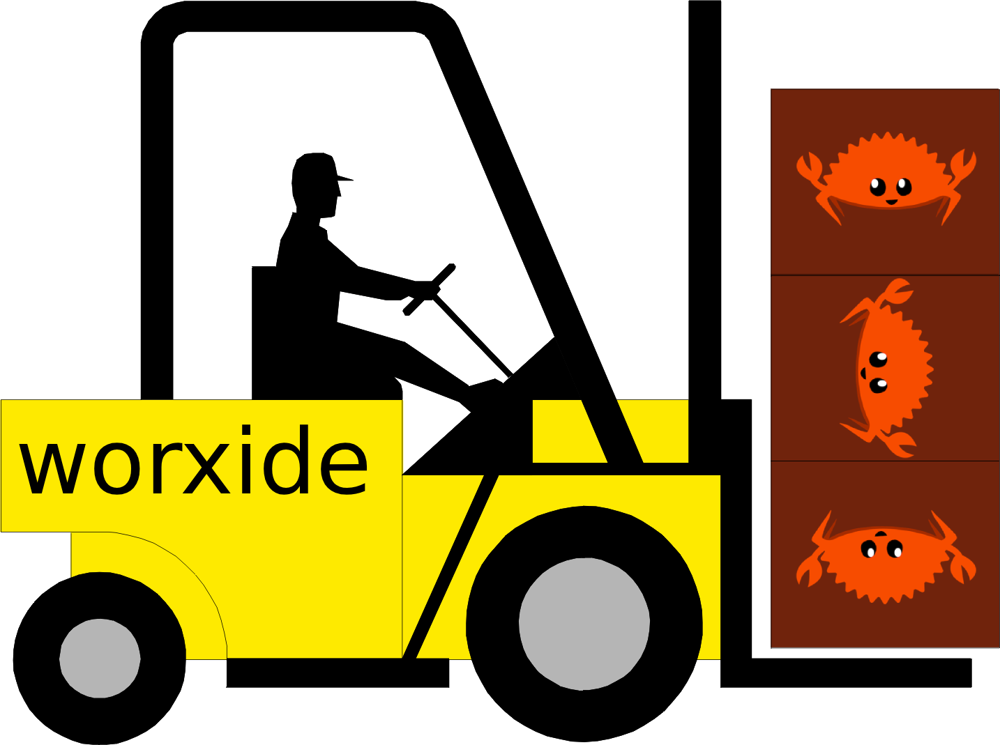

# worxide

<p align="center">
  
</p>

Spawn a Rust function on a Web Worker and `await` its result — passing **any
`T`** in and out with **no serialization, no deserialization, and no copying**.

```rust
// A CPU-bound function over arbitrary Rust types:
fn analyze(data: Vec<Record>) -> Report { /* ... */ }
let report: Report = worxide::spawn_blocking!(analyze, records).await?;

// An async function:
async fn fetch_and_crunch(id: u32) -> Vec<u8> { /* ... */ }
let bytes: Vec<u8> = worxide::spawn!(fetch_and_crunch, 7).await?;
```

That's the whole API: two macros, `spawn!` and `spawn_blocking!`. Both return
`anyhow::Result<R>` where `R` is the function's return type, inferred — no
turbofish, no manual serialization, no worker boilerplate.

## The big idea: move any `T` across threads for the cost of a pointer

Other ways of getting work onto a Web Worker make you pay a tax on your data:
`postMessage`-based approaches (gloo-worker, wasm-mt) must **serialize** your
argument to bytes, **copy** it across the worker boundary, and **deserialize**
it on the other side — then do the same dance with the result. The bigger and
more deeply-structured your `T`, the more that costs.

worxide doesn't move your data across the boundary at all. It moves a *pointer*.

Because every worker shares one `SharedArrayBuffer`-backed linear memory, your
value already lives somewhere both threads can see. worxide boxes it, hands the
worker the resulting pointer (a single `usize`), and the worker reads the value
back in place. A `Vec<HashMap<String, Vec<Record>>>` crosses threads exactly as
fast as a `u8` does — because in both cases the only thing that actually crosses
is one integer.

- **Any `T`.** Not just numbers, slices, or `Serialize` types — *any* owned Rust
  value, however nested. No trait bounds beyond `'static`, no `serde`.
- **No serialization / deserialization.** The value is never encoded or decoded.
- **No copy.** Ownership is *moved* through the pointer; the value isn't
  duplicated in memory.

This is what makes it fast, and it's the main reason to choose worxide.

## How it works

worxide compiles your crate to `wasm32-unknown-unknown` with shared linear
memory. When you `spawn!` a function:

1. The closure (capturing your arguments) is boxed; its pointer is handed to a
   freshly created Web Worker along with the `WebAssembly.Module` and the shared
   `Memory`.
2. The worker instantiates the same module against the *same* shared memory,
   reads the boxed closure back through the pointer, and runs it.
3. The result is boxed in shared memory; its pointer is posted back to the
   caller, which un-boxes it into a typed `R`.

The only values that ever cross the `postMessage` boundary are pointers
(integers). Your arguments and results stay put in shared memory the entire
time — no `JsValue` round-tripping, no encoding, no copies.

## How it differs from the alternatives

| | model | data crossing | when to reach for it |
|---|---|---|---|
| **worxide** | one fresh worker per `spawn!` call, arbitrary function | **any `T` by pointer — no serialize, no copy** | offloading individual ad-hoc tasks off the main thread |
| **wasm-bindgen-rayon** | fixed, persistent thread pool sized up front (`initThreadPool(n)`) | shared memory, but only `par_iter()` over slices | data-parallel work over a known dataset |
| **gloo-worker / wasm-mt** | long-lived worker actors | serialize → copy → deserialize every message | message-passing actors; no `SharedArrayBuffer` needed |

In short: reach for **wasm-bindgen-rayon** when you want to parallelize a loop
across a pool; reach for **gloo-worker** when you want actor-style workers and
can't use cross-origin isolation; reach for **worxide** when you just want to
say "run *this function* off-thread and give me the answer."

### Pros

- **Tiny surface.** Two macros. No worker files to author, no message protocol
  to design, no thread pool to size or pre-warm.
- **Typed end to end.** `R` is inferred from the function. Arguments and return
  values are ordinary Rust values, not `JsValue`s.
- **Zero-copy hand-off.** Data passes by pointer through shared memory rather
  than being serialized through `postMessage`.
- **Sync and async.** `spawn_blocking!` for CPU-bound functions,
  `spawn!` for `async fn`s — the worker drives the future to completion itself.
- **No build-time worker path.** The worker bootstrap is embedded in the crate
  and served from a Blob URL; the consumer's glue path is resolved at runtime.

### Cons / trade-offs

- **One worker per call.** worxide spawns and terminates a worker for each
  `spawn!`. That's the right model for discrete tasks, but it is *not* a thread
  pool — if you're firing thousands of tiny tasks, the spawn overhead will
  dominate. (Want a pool? Use wasm-bindgen-rayon.)
- **Cross-origin isolation required.** Shared memory needs `SharedArrayBuffer`,
  which needs the page to be cross-origin isolated (COOP + COEP headers). See
  setup below. This is a hard browser requirement, not a worxide choice.
- **Nightly Rust + `build-std`.** wasm threads aren't stable yet, so you need a
  nightly toolchain and an unstable `build-std`. (Same constraint as every
  other wasm-threading crate today.)
- **`--target web` only.** Relies on `WebAssembly.Module`/`Memory` access and JS
  snippets, which are only available on wasm-bindgen's `web` target.
- **Arguments must be `'static` + `Send`-shaped for the move.** The closure is
  moved into the worker; captured data must be owned (or otherwise valid to send
  across the boundary).

## Setup

There are four moving parts: the toolchain, the build flags, the build command,
and the cross-origin-isolation headers.

### 1. Toolchain

worxide needs nightly Rust with the `wasm32-unknown-unknown` target and the
`rust-src` component (for `build-std`). The easiest way is a
`rust-toolchain.toml` in your project root, which makes `rustup` fetch and use
the right toolchain automatically:

```toml
[toolchain]
channel = "nightly"
targets = ["wasm32-unknown-unknown"]
components = ["rust-src"]
```

(Or install it by hand: `rustup toolchain install nightly` then
`rustup +nightly target add wasm32-unknown-unknown` and
`rustup +nightly component add rust-src`.)

### 2. `.cargo/config.toml`

In the **consumer** crate (the one that compiles to wasm), add:

```toml
[target.wasm32-unknown-unknown]
rustflags = [
    "-C", "target-feature=+atomics,+bulk-memory,+mutable-globals",
    "-C", "link-arg=--shared-memory",
    "-C", "link-arg=--max-memory=1073741824",
    "-C", "link-arg=--import-memory",
    "-C", "link-arg=--export=__wasm_init_tls",
    "-C", "link-arg=--export=__tls_size",
    "-C", "link-arg=--export=__tls_align",
    "-C", "link-arg=--export=__tls_base",
    "-C", "link-arg=--export=__heap_base",
    "-C", "link-arg=--export=__data_end",
]

[unstable]
build-std = ["panic_abort", "std"]
```

Why these matter:

- `+atomics,+bulk-memory,+mutable-globals` + `--shared-memory` — enable the
  WebAssembly threads features and make the linear memory shareable.
- `--import-memory` — the memory becomes an *import* so the main thread can
  create it once and every worker can attach to the same instance.
- `--max-memory=1073741824` — shared memory must declare a maximum (here 1 GiB;
  tune to your needs).
- `--export=__wasm_init_tls / __tls_size / __tls_align / __tls_base` — expose the
  thread-local-storage machinery so each worker gets its own TLS block.
- `--export=__heap_base / __data_end` — wasm-bindgen's threading transform needs
  these to inject per-thread state; lld only emits them when asked.

These flags are the same family used by wasm-bindgen-rayon and
wasm-bindgen-spawn — they're what lets wasm-bindgen's threading transform run on
the binary natively, with no post-build patching.

### 3. Build command

```sh
cargo +nightly build --target wasm32-unknown-unknown --release -p your-crate
wasm-bindgen target/wasm32-unknown-unknown/release/your_crate.wasm \
    --out-dir site --target web --no-typescript
```

That's it — no WAT surgery or glue patching. A minimal `build.sh`:

```sh
#!/usr/bin/env bash

cargo +nightly build --target wasm32-unknown-unknown --release -p worxide-example

wasm-bindgen target/wasm32-unknown-unknown/release/worxide_example.wasm --out-dir ./worxide-example/site --target web --no-typescript
```

### 4. Cross-origin isolation (COOP + COEP)

`SharedArrayBuffer` is only available when the page is **cross-origin
isolated**, which requires two response headers:

```
Cross-Origin-Opener-Policy: same-origin
Cross-Origin-Embedder-Policy: require-corp
```

If you control the server, set them there. If you're on static hosting (GitHub
Pages, etc.) where you can't set headers, inject them with a service worker.
`site/sw.js`:

```js
self.addEventListener('install', () => self.skipWaiting());
self.addEventListener('activate', e => e.waitUntil(self.clients.claim()));

self.addEventListener('fetch', event => {
    if (event.request.cache === 'only-if-cached' && event.request.mode !== 'same-origin') {
        return;
    }
    event.respondWith(
        fetch(event.request).then(response => {
            if (response.status === 0) return response;
            const headers = new Headers(response.headers);
            headers.set('Cross-Origin-Embedder-Policy', 'require-corp');
            headers.set('Cross-Origin-Opener-Policy', 'same-origin');
            return new Response(response.body, {
                status: response.status,
                statusText: response.statusText,
                headers,
            });
        })
    );
});
```

Then register it before initializing wasm, and reload once it's controlling the
page. `site/index.html`:

```html
<!DOCTYPE html>
<html>
<head><meta charset="utf-8" /><title>your app</title>
<script>
  // Register the COOP/COEP service worker, then reload so the page loads
  // cross-origin isolated. Skips straight through once isolation is active.
  (async () => {
    if (self.crossOriginIsolated) return;
    if (!('serviceWorker' in navigator)) return;
    await navigator.serviceWorker.register('./sw.js', { scope: './' });
    await navigator.serviceWorker.ready;
    location.reload();
  })();
</script>
</head>
<body>
<script type="module">
  import init, { run } from './your_crate.js';
  if (self.crossOriginIsolated) {
    await init();   // standard wasm-bindgen init on the main thread
    run();          // your entry point
  }
</script>
</body>
</html>
```

> **Don't put DOM/UI work in `#[wasm_bindgen(start)]`.** That start hook runs on
> *every* instantiation of the module — including each worker, which has no DOM.
> Expose a plain `#[wasm_bindgen] pub fn run()` and call it explicitly from the
> main thread only, as above.

## Usage

Add the dependency (the consumer crate is a `cdylib`; worxide is an `rlib`):

```toml
[dependencies]
worxide = "0.0.1"
```

Then call the macros from main-thread code:

```rust
use wasm_bindgen::prelude::*;

fn primes_below(n: u64) -> u64 {
    (2..n).filter(|&k| (2..k).all(|d| k % d != 0)).count() as u64
}

#[wasm_bindgen]
pub fn run() {
    wasm_bindgen_futures::spawn_local(async {
        match worxide::spawn_blocking!(primes_below, 100_000).await {
            Ok(count) => web_sys::console::log_1(&format!("{count} primes").into()),
            Err(e)    => web_sys::console::error_1(&format!("{e}").into()),
        }
    });
}
```

The `primes_below` call runs on a worker; `run()` returns immediately and the
main thread keeps painting at 60fps while the worker grinds.

### Detecting the worker thread: `is_worker()`

The wasm module is instantiated on *every* worker too, so any code reachable at
startup runs there as well. Use `worxide::is_worker()` to guard main-thread-only
work (DOM/UI setup, etc.):

```rust
#[wasm_bindgen]
pub fn run() {
    // Workers have no DOM — never build UI there. Bail early.
    if worxide::is_worker() { return; }

    // ... main-thread-only setup (dominator, canvas, event listeners) ...
}
```

`is_worker()` positively identifies a worker by testing the global scope against
`WorkerGlobalScope`, which is more robust than inferring "worker" from
`web_sys::window().is_none()`.

> Also: don't put this kind of work in `#[wasm_bindgen(start)]`. That hook runs
> on every instantiation, including workers, *before* you get a chance to check.
> Use an explicit `run()` and call it only from the main thread.

## Requirements at a glance

- Nightly Rust with `rust-src`
- `wasm-bindgen-cli` (matching your `wasm-bindgen` dependency version)
- `--target web`
- A cross-origin-isolated page (COOP + COEP, via server headers or the service
  worker above)

## License

MIT